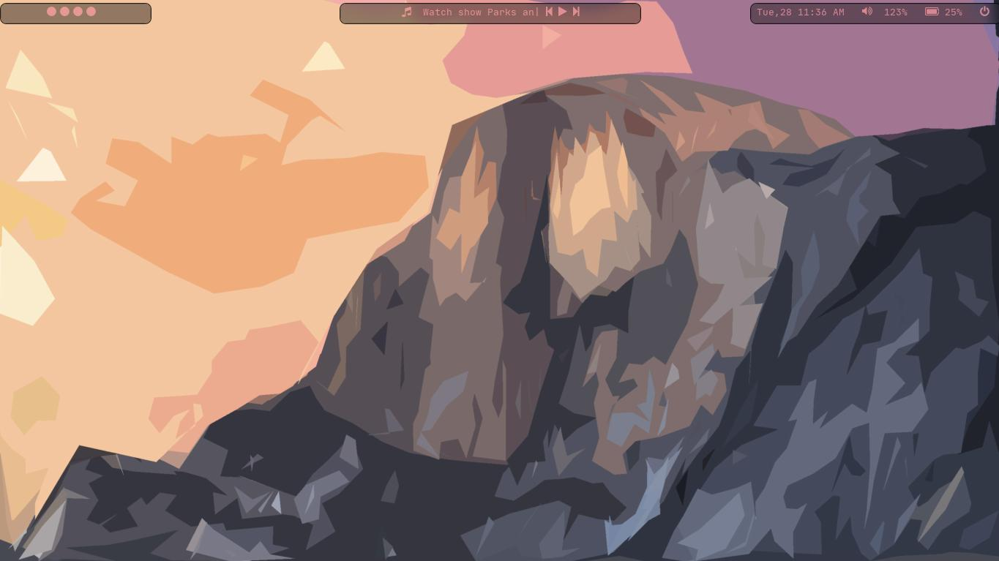
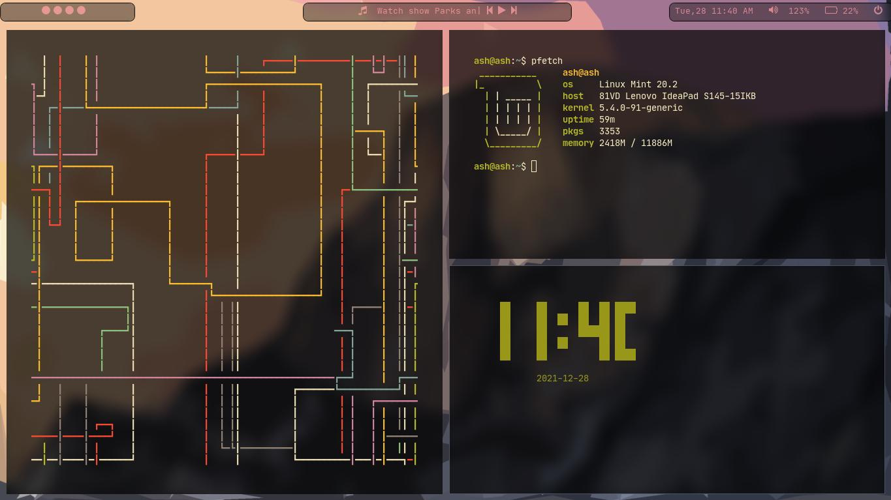

# My First Awesome Rice

## Notes
Remember to Rename The zshrc to .zshrc

## Details
- Distro: Mint
- Shell: Zsh
- WM: Awesome
- Bar: Polybar
- Terminal: Alacritty

### Terminal Programs in the Images
- pipes.sh
- tty-clock
- pfetch

## Time taken
3 days (aaron you suck !!!!!)
